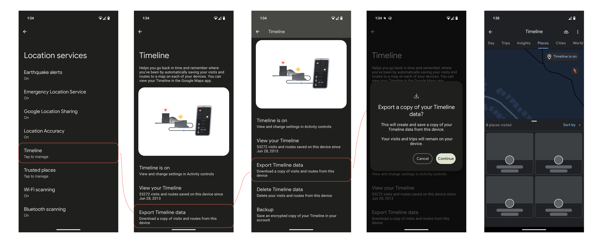

# Google Device Timeline JSON Parser

A Kotlin library for parsing Google's Location History Timeline JSON data exported from device.



## Features

- 🚀 **High Performance**: Uses efficient streaming JSON parsing with Moshi and Okio
- 🔄 **Asynchronous**: Built with Kotlin coroutines for non-blocking operations  
- 📱 **Comprehensive Data Models**: Supports all major timeline data structures including:
  - Semantic segments (places visited, activities)
  - Raw location signals 
  - User location profiles and frequent places
- 🛡️ **Type Safe**: Full Kotlin type safety with data classes
- 🧪 **Well Tested**: Comprehensive test coverage

## Installation

### Gradle (Kotlin DSL)

```kotlin
dependencies {
    implementation("dev.hossain.timeline:lib:1.4")
}
```

### Gradle (Groovy DSL)

```groovy
dependencies {
    implementation 'dev.hossain.timeline:lib:1.4'
}
```

### Maven

```xml
<dependency>
    <groupId>dev.hossain.timeline</groupId>
    <artifactId>lib</artifactId>
    <version>1.4</version>
</dependency>
```

## Quick Start

Get the latest **`.jar`** file containing the `Parser` from [releases](https://github.com/hossain-khan/kgeo-device-timeline/releases).

### Basic Usage (Exception-based API)

```kotlin
import dev.hossain.timeline.Parser
import java.io.File

suspend fun main() {
    val file = File("timeline.json")
    val timeline = Parser.parse(file)

    println("Parsed timeline data with ${timeline.semanticSegments.size} segments")
    println("Parsed timeline data with ${timeline.rawSignals.size} signals")
    println("Parsed timeline data with ${timeline.userLocationProfile.frequentPlaces.size} frequent places")
}
```

### Recommended Usage (Result-based API)

```kotlin
import dev.hossain.timeline.Parser
import dev.hossain.timeline.ParseResult
import java.io.File

suspend fun main() {
    val file = File("timeline.json")
    when (val result = Parser.parseToResult(file)) {
        is ParseResult.Success -> {
            val timeline = result.data
            println("Parsed timeline data with ${timeline.semanticSegments.size} segments")
            println("Parsed timeline data with ${timeline.rawSignals.size} signals")
            println("Parsed timeline data with ${timeline.userLocationProfile.frequentPlaces.size} frequent places")
        }
        is ParseResult.Error -> {
            println("Error parsing timeline: ${result.message}")
        }
    }
}
```

### Advanced Usage with Configuration

```kotlin
import dev.hossain.timeline.Parser
import dev.hossain.timeline.ParserConfig
import java.io.File

suspend fun main() {
    val config = ParserConfig(
        enableLazyLoading = true,
        validateInput = false  // For better performance on trusted input
    )
    val timeline = Parser.parse(file, config)
}
```

### Convenient Factory Methods

```kotlin
import dev.hossain.timeline.Parser

suspend fun main() {
    // Parse from file path
    val result = Parser.fromFile("/path/to/timeline.json")

    // Parse from JSON string
    val jsonString = """{"semanticSegments": [], "rawSignals": [], "userLocationProfile": {"frequentPlaces": []}}"""
    val result = Parser.fromJsonString(jsonString)
}
```

### Legacy Usage (Backward Compatible)

```kotlin
import dev.hossain.timeline.Parser
import java.io.File

suspend fun main() {
    val parser = Parser()
    val file = File("timeline.json")
    val timeline = parser.parse(file)

    println("Parsed timeline data with ${timeline.semanticSegments.size} segments")
    println("Parsed timeline data with ${timeline.rawSignals.size} signals") 
    println("Parsed timeline data with ${timeline.userLocationProfile.frequentPlaces.size} frequent places")
}
```

### Using with InputStream

```kotlin
import dev.hossain.timeline.Parser
import java.io.FileInputStream

suspend fun parseFromStream() {
    val parser = Parser()
    val inputStream = FileInputStream("timeline.json")
    val timeline = parser.parse(inputStream)
    
    // Process timeline data
    timeline.semanticSegments.forEach { segment ->
        println("Visit: ${segment.visit?.topCandidate?.placeId}")
        println("Activity: ${segment.activity?.activityType}")
    }
}
```

### Advanced Usage

```kotlin
import dev.hossain.timeline.Parser

suspend fun analyzeTimelineData() {
    val parser = Parser()
    val timeline = parser.parse(File("timeline.json"))
    
    // Analyze activities
    val activities = timeline.rawSignals
        .mapNotNull { it.activityRecord?.probableActivities }
        .flatten()
        .groupBy { it.type }
        .mapValues { it.value.size }
    
    println("Activity distribution: $activities")
    
    // Find frequent places
    val frequentPlaces = timeline.userLocationProfile.frequentPlaces
    println("You frequently visit ${frequentPlaces.size} places")
    
    frequentPlaces.forEach { place ->
        println("- ${place.location?.name} (confidence: ${place.location?.sourceInfo?.deviceTag})")
    }
}
```

## Data Format

The library parses Google's Location History Timeline JSON format which includes:

### Timeline Data Structure

```kotlin
data class TimelineData(
    val semanticSegments: List<SemanticSegment>,    // Places visited and activities
    val rawSignals: List<RawSignal>,                // Raw location data points
    val userLocationProfile: UserLocationProfile    // User's frequent places
)
```

### Semantic Segments

Semantic segments represent meaningful places and activities:

- **Places visited**: Restaurants, shops, home, work locations
- **Activities**: Walking, driving, cycling, flights
- **Timeline paths**: Route taken between locations
- **Duration and timestamps**: When activities occurred

### Raw Signals  

Raw signals contain the underlying location data:

- **Location coordinates**: Latitude, longitude, altitude
- **Accuracy information**: Location precision and confidence
- **Activity recognition**: Detected movement types
- **Device information**: Source device and platform details

## Error Handling

The parser provides comprehensive error handling:

```kotlin
try {
    val timeline = parser.parse(file)
    // Process timeline
} catch (e: IllegalStateException) {
    // File not found or invalid file
    println("Error: ${e.message}")
} catch (e: JsonDataException) {
    // Invalid JSON format
    println("JSON parsing error: ${e.message}")
} catch (e: IOException) {
    // File reading error
    println("IO error: ${e.message}")
}
```

## Sample Output

```
Parsed timeline data with 51902 segments
Parsed timeline data with 7865 signals
Parsed timeline data with 2 frequent places
Unique activities: [CYCLING, FLYING, IN_PASSENGER_VEHICLE, RUNNING, STILL, WALKING]
```

## API Documentation

Full API documentation is available at: [https://hossain-khan.github.io/kgeo-device-timeline/](https://hossain-khan.github.io/kgeo-device-timeline/)

## Building from Source

### Prerequisites

- JDK 21 or higher
- Gradle 8.12+ (included via wrapper)

### Build Commands

```bash
# Clean and build
./gradlew clean build

# Run tests
./gradlew test

# Generate documentation
./gradlew :lib:dokkaHtml
```

## Contributing

We welcome contributions! Please see [CONTRIBUTING.md](CONTRIBUTING.md) for guidelines on how to contribute to this project.

### Related Resources
* https://github.com/hossain-khan/kgeo-timeline
* https://github.com/CarlosBergillos/LocationHistoryFormat/issues/13#issuecomment-2370748731

## License

This project is licensed under the MIT License - see the [LICENSE](LICENSE) file for details.

## Support

- 📖 [Documentation](https://hossain-khan.github.io/kgeo-device-timeline/)
- 🐛 [Issue Tracker](https://github.com/hossain-khan/kgeo-device-timeline/issues)
